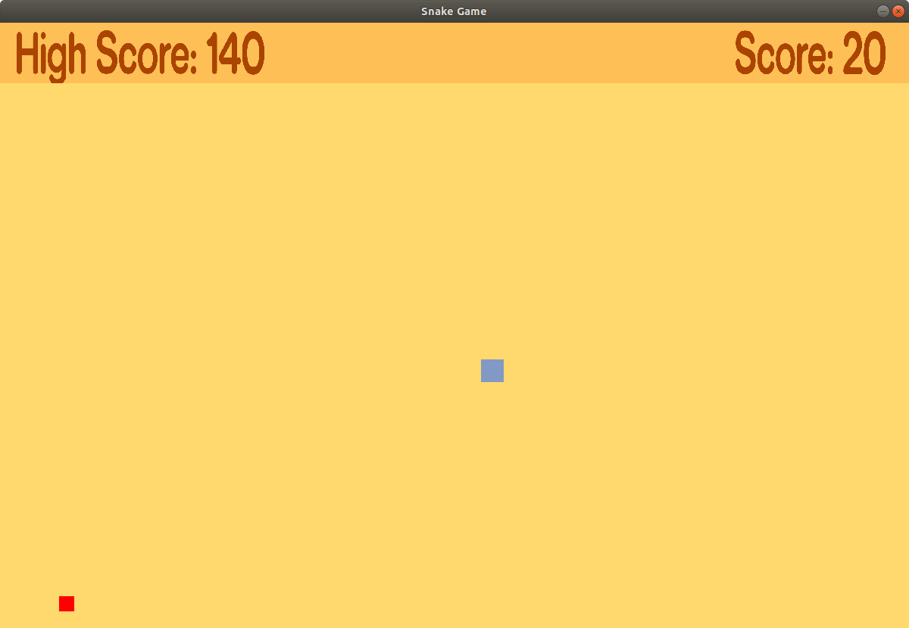

# Snake game using SDL (C/C++ development library)



This is the classic Snake game. It is built using SDL (<http://www.libsdl.org>)
a C/C++ cross-platform library. The language used to build the game is C++.

## Setting up the Game

#### 1. Install SDL2 library

* Download the library from here:

<http://libsdl.org/release/SDL2-2.0.8.zip>

* Extract the downloaded zip file.
```shell
unzip SDL2-2.0.8.zip
```

* Install the dependencies for the library.
```shell
sudo apt-get install build-essential mercurial make cmake autoconf automake \
libtool libasound2-dev libpulse-dev libaudio-dev libx11-dev libxext-dev \
libxrandr-dev libxcursor-dev libxi-dev libxinerama-dev libxxf86vm-dev \
libxss-dev libgl1-mesa-dev libdbus-1-dev libudev-dev \
libgles2-mesa-dev libegl1-mesa-dev libibus-1.0-dev \
fcitx-libs-dev libsamplerate0-dev libsndio-dev
```

* Compile and Install the SDL2 library.
```shell
cd SDL2-2.0.8/
./configure
make
sudo make install
```

#### 2. Clone this repo. and compile it using the Makefile.
```shell
cd snake-game-sdl
make
```

## Run the Game

To run the game, type the following:
```shell
./snake
```


